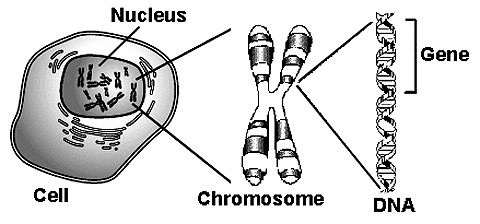

<!-- MATHJAX -->

# Genetic Algorithms
In the 1950s and the 1960s several computer scientists independently studied
evolutionary systems with the idea that evolution could be used as an
optimization  tool for engineering problems. The idea in all these systems was
to evolve a population of candidate solutions to a given problem, using
operators inspired by natural genetic variation and natural selection.

Genetic algorithms (GAs) were invented by John Holland in the 1960s and were
developed by Holland and his students and colleagues at the University of
Micigan in the 1960s and 1970s. In contrast with evolution strategies and
evolutionary programming, Holland's original goal was not to design algorithms
to solve specific problems, but rather to formally study the phenomenon of
adaptation as it occurs in nature and to develop ways in which the mechanism of
natural adaptation might be imported into computer systems.

Genetic Algorithms (GA) are a family of computational models inspired by
evolution. These algorithms encode a potential solution to a specific problem
on a simple chromosome-like data structure and apply recombination operators to
these structures so as to preserve critical information. Genetic algorithms are
often viewed as function optimizers, although the range of problems to which
genetic algorithms have been applied is quite broad.

## Biological Terminology
In this section we will briefly discuss biological terms used in GAs.

- **DNA**: Deoxyribonucleic acid or DNA is the chemical information database
  that carries the **complete set** of instructions for the cell as to the
  nature of the proteins produced by it, its life span, maturity, function and
  death.

- **Chromosomes**: are strings of DNA and protein found in cells that serve as
  a _blueprint_ for the organism. It serves to package the DNA and control its
  functions.

- **Genes**: are working sub units of DNA. Each gene contains a **subset** of
  instructions, usually coding for a particular protein or for a particular
  function.

- **Allels**: are different possible _settings_ for a gene trait, (e.g. eye
  colour can be blue, brown, hazel ...).

- **Genome**: many organisms have multiple chromosomes in each cell. The
  complete collection of genetical material (all chromosomes taken together) is
  called the organism's genome.

- **Genotype**: refers to the **subset** of genes contained in a genome. Two
  individuals that have identical genomes are said to have the same genotype.

- **Phenotype**: are developed genotype under fetal and after stages, where
  physical and mental traits are developed (eg. eye colour, brain size,
  intelligence, etc).

## Search Spaces and Fitness Landscapes
### Search Space
The idea of searching among a collection of candidate solutions for a desired
solution is so common in computer science that it has been given its own name:
searching in a **search space**. Here what we refer to search space is the
collection of all possible candidate solutions to a problem.

### Fitness Landscape
A **fitness landscape** is a prepresentation of the space of all possible
genotypes along with their fitnesses.

Suppose, for the sake of simplicity, that each genotype is a bit string of
length l, and that the distance between two genotypes is their **Hamming
distance**, the number of locations at which corresponding bits differ. Also
suppose that each genotype can be assigned a real-valued fitness. A fitness
landscape can be picture as an (l + 1)-dimensional plot in which each genotype
is a point in l dimensions and its fitness is plotted along the (l + 1) axis.

A simple landscape may have hills, valleys and peaks, this is where _evolution_
causes populations to move along landscapes in particular ways, and
**adaptation** can be seen as the movement toward local peaks or troffs (local
maxima or minima) depending on the fitness function.

## Encodings and Optimization Problems Usually there are only two main
components of most genetic algorithms that are problem dependent:

- Problem of encoding
- Evaluation function (or fitness function)

## Genetic Algorithm Pseudo Code
An implementation of a genetic algorithm begins with a population of (typically
random) chromosomes. One then evaluates these structures and allocates
reproductive opportunities in such a way that those chromosomes which represent
a better solution to the target problem are given more chances to "reproduce"
than those chromosomes which are poorer solutions. The "goodness" of a solution
is typically defined with respect to the current population.

1. Start with randomly generated population of $n$ $l$-bit chromosomes
   (candidate solutions to a problem).

2. Calculate the fitness $f(x)$ of each chromosome $x$ in the population.

3. Repeat following until $n$ offspring have been created:

    3.1. Select a pair of parent chromosomes from current population, with
    probability of selection being an increasing function of fitness. Selection
    is done "with replacement", meaning that the same chromosome can be
    selected more than once to become a parent.

    3.2. With probability $p_{c}$ (crossover probability or crossover rate),
    crossover the pair at randomly chosne point (chosen with uniform
    probability) to form two offspring. If no crossover takes place, form two
    offspring that are exact copies of their respective parents.

    **Note**: here the crossover rate is defined to be the probability that two
    parents will crossover in a single point. There are also "multipoint
    crossover" versions of the GA which the crossover rate for a pair of
    parents is the number of points at which a crossover takes place.

    3.3 Mutate the two offspring at each locus with probability $p_{m}$
    (mutation probability or mutation rate), and place the resulting
    chromosomes in the new population.

    3.4 If $n$ is odd, one new population member can be discarded at random

4. Replace current population with the new population

5. Go to step 2

Each iteration of this process is called a **generation**. A GA is typically
iterated from anywhere from 50 to 500 or more generations. The entire set of
generations is called a **run**. At the end of a run there are often one or
more highly fit chromosomes in the population. Since randomness plays a large
role in each run, two runs with different random-number seeds will generally
produce different detailed behaviours. GA researchers often report statistics
(such as the best fitness found in a run and the generation at which the
individual with that best fitness was discovered) averagaed over many different
runs of the GA on the same problem.

The simple procedure jsut described is the basis for most applications of GAs.
There are a number of details to fill in, such as the size of the population
and the probabilities of crossover and mutation, and the success of the
algorithm often depends greatly on these details. There are also more
complicated versions of GAs, which will not be covered here.

